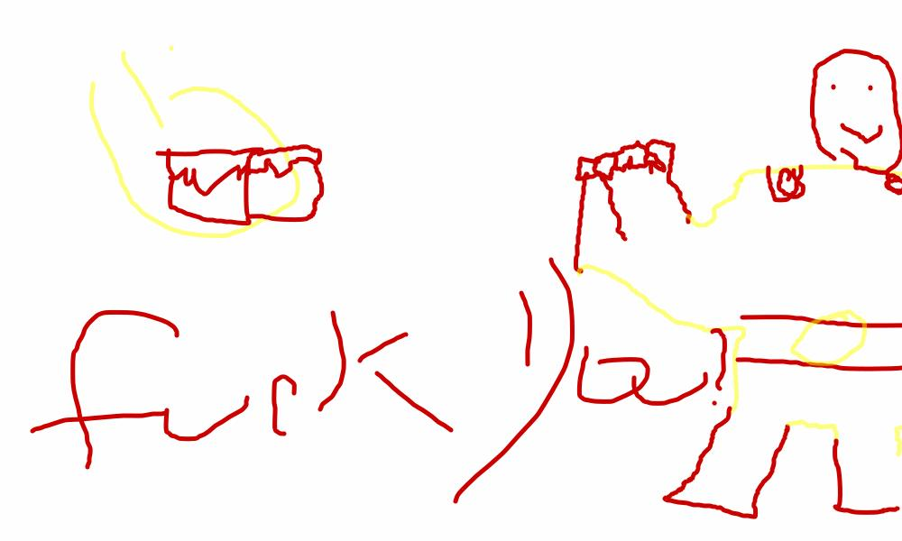

# improved-happiness
Prints "Fuck You!" followed by a new-line 100 times.
In Java, which means you can do it in Minecraft, of course. Here is our roadmap.

# Our Story
So as you can see this man is going to punch the Minecraft dirt block but because of our expert code the block deflected his punch with a "Fuck You!"

